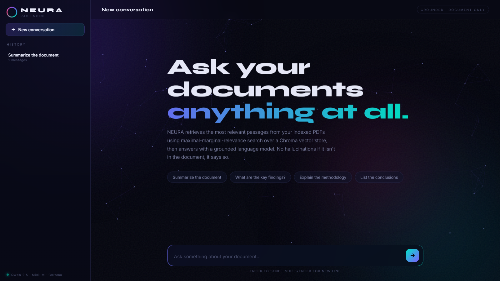

# NEURA — Document RAG Chat Engine

An end-to-end **Retrieval-Augmented Generation (RAG)** project: index a PDF into a Chroma vector store, then chat with it through a fully custom animated web UI. Answers are grounded strictly in the document — if it isn't in the PDF, NEURA says so.



## Features

- **Grounded Q&A** : retrieves the most relevant passages using **MMR (maximal marginal relevance)** search over a Chroma vector store, then answers with `Qwen/Qwen2.5-7B-Instruct` via the Hugging Face Inference API
- **Custom frontend** : particle-field canvas, aurora gradients, and glassmorphism, served straight from FastAPI (no build step)
- **Persistent chat history** : conversations stored in SQLite and restored in the sidebar
- **Local embeddings** : `sentence-transformers/all-MiniLM-L6-v2` runs on your machine, so indexing is free

## Project structure

| Path | What it is |
|---|---|
| `app.py` | FastAPI app: RAG pipeline + SQLite chat history + the NEURA frontend |
| `create_database.py` | Indexing script: PDF -> chunks -> embeddings -> Chroma |
| `main.py` | CLI version of the RAG pipeline |
| `1_document_loaders/` | Document loading & text-splitting experiments (PDF, web pages) |
| `Retrievers/` | Retriever experiments: MMR, multi-query, ArXiv |

## Getting started

**1. Install dependencies**

```bash
python -m venv .venv
.venv\Scripts\activate        # Windows
pip install -r requirements.txt
```

**2. Add your API keys**

Copy `.env.example` to `.env` and fill in your keys (only `HF_TOKEN` is required for the app):

```bash
cp .env.example .env
```

**3. Build the vector database**

Drop your PDF at `1_document_loaders/PDF.pdf` (or edit the path in `create_database.py`), then:

```bash
python create_database.py
```

**4. Run the app**

```bash
python app.py
```

Open http://127.0.0.1:8000 and start asking questions.

## How it works

```
PDF -> RecursiveCharacterTextSplitter -> MiniLM embeddings -> Chroma
                                                                    │
User question -> MMR retrieval (k=4) -> context + prompt -> Qwen 2.5 7B -> grounded answer
```

## Tech stack

LangChain · Chroma · Hugging Face (Qwen 2.5, MiniLM) · FastAPI · SQLite · vanilla JS/CSS frontend
