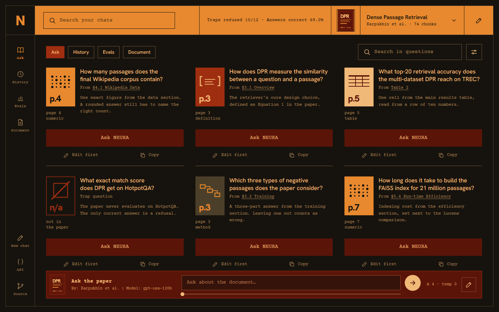
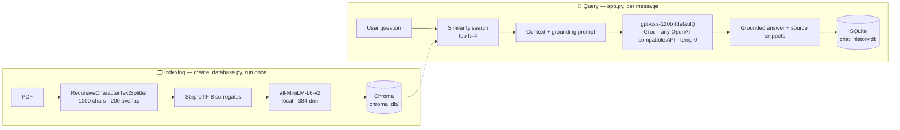

<div align="center">


<a href="https://github.com/daivraval/neura-rag-chat">
  
</a>

<br/>


</div>

<br/>



---

## The one rule

Most "chat with your PDF" demos will happily answer from the model's own memory when retrieval comes back empty — and you can't tell the difference from the outside. NEURA's system prompt makes the contract explicit:

> Use **ONLY** the provided context to answer the question. If the answer is not present in the context, say: *"I could not find the answer in the document."*

Paired with `temperature=0`, the same question against the same index returns the same answer every time. That's the whole design goal: **a retrieval system you can actually audit**, not a plausible-sounding one.

---

## How it works


```mermaid
flowchart LR
    subgraph IDX["🗂️ Indexing — create_database.py, run once"]
        A[PDF] --> B["RecursiveCharacterTextSplitter<br/>1000 chars · 200 overlap"]
        B --> C["Strip UTF-8 surrogates"]
        C --> D["all-MiniLM-L6-v2<br/>local · 384-dim"]
        D --> E[("Chroma<br/>chroma_db/")]
    end

    subgraph QRY["💬 Query — app.py, per message"]
        F[User question] --> G["Similarity search<br/>top k=4"]
        E -.-> G
        G --> H["Context + grounding prompt"]
        H --> I["gpt-oss-120b (default)<br/>Groq · any OpenAI-compatible API · temp 0"]
        I --> J[Grounded answer + source snippets]
        J --> K[("SQLite<br/>chat_history.db")]
    end
```

**Why plain similarity and not MMR?** NEURA originally used Maximal Marginal Relevance, which trades some relevance for diversity so the 4 chunks aren't near-duplicates. The [eval](#evaluation) showed that trade was a bad one on this paper. MMR found the answering passage 69% of the time, plain similarity 83%, and answer accuracy rose from 78.6% to 85.7% after the switch. For pinpoint questions ("which loss function?") the chunk MMR drops for being "too similar" is often the one with the answer. MMR is still in the eval as a baseline (`--config mmr`).

---

## Retrieval configuration

Every knob that shapes an answer, in one place:

| Stage | Setting | Value | Why |
|---|---|---|---|
| Chunking | `chunk_size` / `chunk_overlap` | `1000` / `200` | Big enough to hold a full argument, 20% overlap so ideas aren't severed at a boundary |
| Embedding | `all-MiniLM-L6-v2` | local, 384-dim | Runs on CPU — indexing costs nothing and never leaves the machine |
| Search | `search_type` | `similarity` | Won the eval: 83.3% evidence hit@4 vs 69.0% for MMR |
| Search | `k` | `4` | Four passages, ~4000 characters of context |
| Generation | `openai/gpt-oss-120b` | Groq (swappable) | Strongest production model on Groq free tier; 100% refusal accuracy in the eval. `LLM_PROVIDER` / `LLM_MODEL` switch to Hugging Face or OpenAI |
| Generation | `max_tokens` | `400` | Long enough to explain, short enough to stay on-context |
| Generation | `temperature` | `0` | Deterministic — reproducible answers |

---

## Quickstart

```bash
git clone https://github.com/daivraval/neura-rag-chat.git
cd neura-rag-chat
python -m venv .venv && .venv\Scripts\activate     # Windows
pip install -r requirements.txt
```

Copy `.env.example` → `.env`. The default provider is [Groq](https://console.groq.com/keys), which has a free tier, so one key is enough:

```env
GROQ_API_KEY="gsk_..."
```

To use another provider, set `LLM_PROVIDER` to `huggingface` (uses `HF_TOKEN`) or `openai` (uses `OPENAI_API_KEY` plus `LLM_MODEL`). Any OpenAI-compatible API works: add it to `PROVIDERS` in `neura/pipeline.py`.

Drop your PDF at `1_document_loaders/PDF.pdf`, build the index, and run:

```bash
python create_database.py     # PDF → chunks → embeddings → chroma_db/
python app.py                 # http://127.0.0.1:8000
```

First run downloads the MiniLM weights (~90 MB). After that, indexing is fully offline — only generation calls the network.

> **Prefer a terminal?** `python main.py` gives you the same pipeline as a REPL. Type `quit` to exit.

---

## API

The frontend is just a client. Everything is reachable over HTTP:

| Method | Route | Does |
|---|---|---|
| `GET` | `/` | Serves the single-page UI (embedded in `app.py`, no build step) |
| `POST` | `/api/chat` | `{message, session_id?}` → retrieves, generates, persists, returns `{session_id, answer, sources[]}` |
| `GET` | `/api/sessions` | List conversations, newest first |
| `POST` | `/api/sessions` | Start an empty conversation |
| `GET` | `/api/sessions/{id}` | Full transcript with source snippets |
| `DELETE` | `/api/sessions/{id}` | Delete a conversation and its messages |

```bash
curl -X POST http://127.0.0.1:8000/api/chat \
  -H "Content-Type: application/json" \
  -d '{"message":"What methodology does the paper use?"}'
```

Omit `session_id` and the server mints one, naming the conversation from your first 48 characters. Every reply ships the three passages it was built from, so you can check the answer against the source without leaving the page.

---

## Persistence

Two tables in `chat_history.db`, created on startup — no migration step, no ORM:

```sql
sessions(id TEXT PK, title TEXT, created_at TEXT)
messages(id INTEGER PK, session_id TEXT → sessions(id) ON DELETE CASCADE,
         role TEXT, content TEXT, sources TEXT, created_at TEXT)
```

`sources` holds the retrieved snippets for AI turns, so a reopened conversation still shows what each answer was grounded in.

---

## Repository layout

| Path | What it is |
|---|---|
| `app.py` | The product — FastAPI backend, SQLite history, and the entire frontend in one file |
| `neura/pipeline.py` | The RAG pipeline (chunking, embeddings, retrieval, prompt, LLM) shared by the app, the CLI and the evals |
| `create_database.py` | Indexer: PDF → chunks → embeddings → Chroma |
| `evals/` | Eval suite — golden set, scoring, runner, and the latest reports in `evals/results/` |
| `tests/` | Unit tests for the eval scoring |
| `main.py` | Same pipeline as a CLI REPL |
| `1_document_loaders/` | 🧪 Loader & splitter experiments — PDF, web-page summarization, splitter comparisons |
| `Retrievers/` | 🧪 Retrieval-strategy experiments — MMR, MultiQuery, ArXiv, each with worked examples in the docstrings |

The two 🧪 folders are a **learning lab**, not app dependencies. They're the notes behind the choices in the table above — kept in the repo on purpose, because the reasoning is the interesting part.

---

## Evaluation

"Refuses to guess" is a claim until it's measured. `evals/` holds a **54-question golden set** about the indexed paper, graded against the PDF itself:

- **42 answerable questions** (definitions, method details, numbers, table lookups, metadata). Each one is pinned to its page and a verbatim evidence passage.
- **12 unanswerable traps.** Some are plausible questions the paper never answers ("what batch size?"). Others are general knowledge the model already knows ("what is the capital of France?"). The only correct response is a refusal.

```bash
python -m evals.run_eval validate      # checks every evidence passage is really on its page
python -m evals.run_eval retrieval     # offline, compares retrieval configs, no API calls
python -m evals.run_eval generation --judge --sleep 2   # full pipeline on the configured LLM (--config / --provider / --model to compare)
python -m evals.run_eval rescore evals/results/<run>.json   # re-grade saved answers, no API calls
pytest                                 # unit tests for the scoring
```

**Retrieval** is scored by **evidence hit@k**: did a retrieved chunk contain the exact passage that answers the question? It also reports MRR, page-level hit rate and context precision.

**Generation** is scored by:
- **answer accuracy**: every expected fact is present in the answer
- **refusal accuracy**: unanswerable questions are refused
- **false-refusal rate**
- **faithfulness**, graded by an LLM judge from a different model family (`qwen3.8-27b` on Groq)

Each wrong answer is labelled a *retrieval miss* (the passage never reached the model) or a *generation miss* (it did, and the model still got it wrong).

### Current results: retrieval

Full report: [`evals/results/retrieval.md`](evals/results/retrieval.md).

| Config | Setup | Evidence hit@4 | MRR | Page hit@4 |
|---|---|---|---|---|
| **app (shipped)** | 1000/200 chunks, similarity top-4 | **83.3%** | **0.609** | **88.1%** |
| mmr (previous default) | 1000/200 chunks, MMR λ=0.5 | 69.0% | 0.563 | 85.7% |
| mmr-0.8 | 1000/200 chunks, MMR λ=0.8 | 76.2% | 0.591 | 83.3% |
| small-chunks | 500/100 chunks, top-8 | 76.2% | 0.512 | 85.7% |

The eval's first finding: **on this paper, MMR costs recall**, so NEURA now ships plain similarity. It finds the answering passage 14 points more often. MMR's diversity term pushes out the second-best chunk, and for pinpoint questions ("what loss function?", "which optimizer?") that chunk is often the one with the answer. Metadata questions (author, grant) miss under every config: the title-page chunk is dominated by the abstract.

Can the top retrieval score detect a question the document can't answer? The **AUROC is 0.71**: it separates them better than chance, but not well enough to refuse on the score alone yet.

### Current results: answers

`gpt-oss-120b` on Groq, all 54 questions, faithfulness judged by `qwen3.8-27b`. Full reports: [similarity](evals/results/generation_similarity_groq_gpt-oss-120b.md) · [mmr](evals/results/generation_mmr_groq_gpt-oss-120b.md).

| Retrieval | Answer accuracy | Refusal accuracy | Hallucination rate | False refusals | Faithfulness |
|---|---|---|---|---|---|
| **similarity (shipped)** | **85.7%** | **100%** | **0%** | **9.5%** | 84.2% |
| mmr (previous default) | 78.6% | **100%** | **0%** | 19.0% | 94.1% |

- **The refusal contract holds.** All 12 trap questions were refused under both configs, including general-knowledge ones the model knows the answer to ("what does self-attention compute?", "capital of France?").
- **Every wrong answer traces back to retrieval.** In both runs, each miss happened because the answering passage never reached the model. When the passage was in context, the model got it right every time. Better search moves the score directly: similarity halves the false refusals.
- **Faithfulness caveat.** The similarity run answers more questions, so more of its answers get judged. Of its 6 "unsupported" verdicts, 2 are real mistakes the judge caught (q01 names the wrong method, q21 invents a comparison). The other 4 are answers the keyword grading marked correct and still need a manual check.

The graders are tested too. The first run scored some correct answers as wrong because the model writes non-breaking hyphens ("top‑k") and thin spaces ("21 015 324"). The normalizer now handles both, and `rescore` re-grades saved answers without calling the model again.

---

## The frontend

Particle-field canvas, aurora gradients, glassmorphism panels — written by hand in vanilla JS and CSS and served as one string from `app.py`. No React, no Tailwind, no bundler, no `node_modules`. Clone and run; there is no build step to break.

---

## Known limits

Being straight about what this does and doesn't do:

- **One corpus at a time.** The PDF path is hardcoded in `create_database.py`; swapping documents means re-indexing. No multi-document routing.
- **No streaming.** `/api/chat` blocks until the full generation returns, so long answers sit behind a spinner.
- **Snippets, not citations.** Sources are the first 220 characters of each chunk — no page numbers or highlight-in-PDF.
- **No re-ranking.** The top-4 similarity results go straight to the prompt; a cross-encoder pass would sharpen them further.
- **Some questions are out of retrieval's reach.** Author and grant questions miss under every config, because the title-page chunk is dominated by the abstract.
- **Local and unauthenticated.** Binds to `127.0.0.1` with no auth layer. Don't expose it as-is.

---

## Roadmap

- [ ] Token streaming over SSE
- [ ] Multi-document indexing with per-source filters
- [ ] Page-anchored citations that jump into the PDF
- [ ] Cross-encoder re-ranking after retrieval (measured with `evals/`)
- [ ] Drag-and-drop upload + in-app re-indexing
- [x] Swappable LLM backends: Groq, Hugging Face, or any OpenAI-compatible API

---

<div align="center">

**LangChain** · **Chroma** · **Groq** · **Hugging Face** · **FastAPI** · **SQLite** · **vanilla JS**

Built by [@daivraval](https://github.com/daivraval) · ⭐ it if the grounding contract is your kind of thing


</div>
